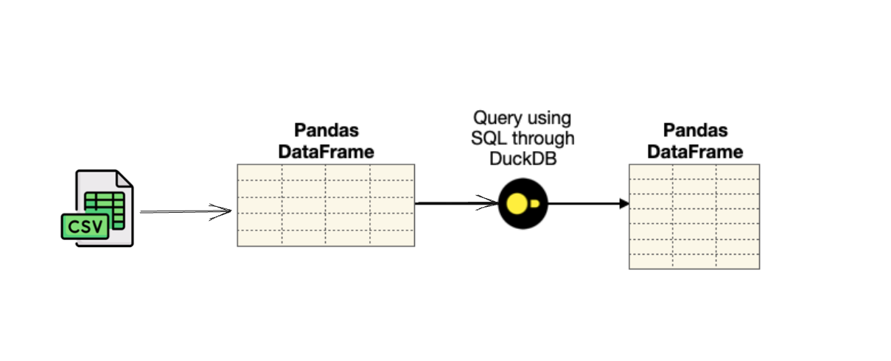

<div align="center">
    <h1>Data Skills</h1>
</div>

<br />

<p align="center">
  
</p>


#### Table of contents
1. [What is this repo about?](#what-is-this-repo-about)
2. [How to run this code](#how-to-run-this-code)
3. [Improvements and other ideas?](#improvements-and-other-ideas)


## What is this repo about?
This repository shows how to

* **fetch** datasets representing a subset of the apps in the [iOS App Store](https://www.kaggle.com/datasets/gauthamp10/apple-appstore-apps) and [Google Play Store](https://www.kaggle.com/datasets/gauthamp10/google-playstore-apps).
* **transform/view** different features of the datasets such as Categorical, Datetime and Numerical columns, and
* **analyze & plot** some of the key question via [DuckDb](https://duckdb.org/) and Pandas and Plotting them via [Seaborn](https://seaborn.pydata.org/). 


## How to run this code

Pre-requisite is to have Python and Pipenv installed on the laptop. Follow below steps to run the script to download the data and jupyter notebook.

1. Dataset will be downloaded through [Kaggle CLI](https://github.com/Kaggle/kaggle-api#installation). Export kaggle username and key as below to use the CLI.
    ```
    $ export KAGGLE_USERNAME=<your user name>
    $ export KAGGLE_KEY=<your kaggle api key>
    ```

2. Run below command which will activate the python virtual environment and will also install dependencies mentioned in Pipfile.
    ```
    $ make init
    ```


3. Run below command which will download the datasets in `data/` directory.
    ```
    $ make fetch-datasets
    ```

4. To run the Notebook locally, 
    ```
    $ start-jupyter
    ```

5. Above command will start the Jupyter and a browser window will be opened. You can see the list of notebooks. Open the notebook `DataAnalytics.ipynb`.

6. Run all the cells.

7. For shutdown, kill the jupyter session from the terminal.

> ℹ️ **Implementation details**
>
>* Kaggle datasets downloaded via [Kaggle CLI](https://github.com/Kaggle/kaggle-api#installation) for which you need to provide your `username` and `api key` generated from Kaggle Account Settings page. Data is files are extracted from ZIP files and placed into `data/` directory.
>
>* Data Is loaded to Pandas via CSV api.
>
>* [DuckDb](https://duckdb.org/) is used to query the in-memory data from Pandas via SQL. As DuckDB uses the same memory allocated to Pandas dataframe, the results are really fast.
>
>* Query result returned by DuckDB is transformed into Pandas DataFrame which is used to plot via [Seaborn](https://seaborn.pydata.org/). 

## Improvements and other ideas

1. Load data directly to DuckDB instead of Pandas
2. Try other alternatives as well such as, streaming/batch ingestion to ClickHouse, build marts via DBT and connect visualisation tools directly to ClickHouse for querying and dashboarding the marts created via DBT.
3. DBT workflow can orchestrated via Airflow, Dagster or any other scheduling tool 
4. ....